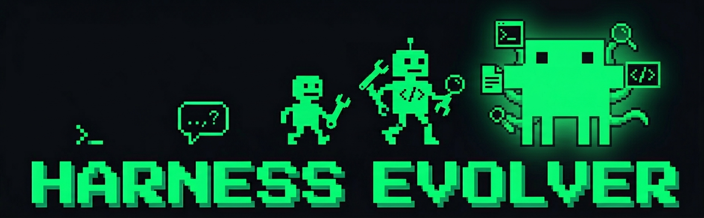

<p align="center">
  
</p>

# Harness Evolver

<p align="center">
  <a href="https://www.npmjs.com/package/harness-evolver"></a>
  <a href="https://github.com/raphaelchristi/harness-evolver/blob/main/LICENSE"></a>
  <a href="https://arxiv.org/abs/2603.28052"></a>
  <a href="https://github.com/raphaelchristi/harness-evolver"></a>
</p>

**LangSmith-native autonomous agent optimization.** Point at any LLM agent codebase, and Harness Evolver will evolve it — prompts, routing, tools, architecture — using multi-agent evolution with LangSmith as the evaluation backend.

Inspired by [Meta-Harness](https://yoonholee.com/meta-harness/) (Lee et al., 2026). The scaffolding around your LLM produces a [6x performance gap](https://arxiv.org/abs/2603.28052) on the same benchmark. This plugin automates the search for better scaffolding.

---

## Install

### Claude Code Plugin (recommended)

```
/plugin marketplace add raphaelchristi/harness-evolver-marketplace
/plugin install harness-evolver
```

Updates are automatic. Python dependencies (langsmith, langsmith-cli) are installed on first session start via hook.

### npx (first-time setup or non-Claude Code runtimes)

```bash
npx harness-evolver@latest
```

Interactive installer that configures LangSmith API key, creates Python venv, and installs all dependencies. Works with Claude Code, Cursor, Codex, and Windsurf.

> **Both install paths work together.** Use npx for initial setup (API key, venv), then the plugin marketplace handles updates automatically.

---

## Quick Start

```bash
cd my-llm-project
export LANGSMITH_API_KEY="lsv2_pt_..."
claude

/evolver:setup      # explores project, configures LangSmith
/evolver:evolve     # runs the optimization loop
/evolver:status     # check progress
/evolver:deploy     # tag, push, finalize
```

---

## How It Works

<table>
<tr>
<td><b>LangSmith-Native</b></td>
<td>No custom eval scripts or task files. Uses LangSmith Datasets for test inputs, Experiments for results, and an agent-based LLM-as-judge for scoring via langsmith-cli. No external API keys needed. Everything is visible in the LangSmith UI.</td>
</tr>
<tr>
<td><b>Real Code Evolution</b></td>
<td>Proposers modify your actual agent code — not a wrapper. Each candidate works in an isolated git worktree. Winners are merged automatically.</td>
</tr>
<tr>
<td><b>5 Adaptive Proposers</b></td>
<td>Each iteration spawns 5 parallel agents: exploit, explore, crossover, and 2 failure-targeted. Strategies adapt based on per-task analysis. Quality-diversity selection preserves per-task champions.</td>
</tr>
<tr>
<td><b>Agent-Based Evaluation</b></td>
<td>The evaluator agent reads experiment outputs via langsmith-cli, judges correctness using the same Claude model powering the other agents, and writes scores back. No OpenAI API key or openevals dependency needed.</td>
</tr>
<tr>
<td><b>Production Traces</b></td>
<td>Auto-discovers existing LangSmith production projects. Uses real user inputs for test generation and real error patterns for targeted optimization.</td>
</tr>
<tr>
<td><b>Active Critic</b></td>
<td>Auto-triggers when scores jump suspiciously fast. Detects evaluator gaming AND implements stricter evaluators to close loopholes.</td>
</tr>
<tr>
<td><b>ULTRAPLAN Architect</b></td>
<td>Auto-triggers on stagnation. Runs with Opus model for deep architectural analysis. Recommends topology changes (single-call to RAG, chain to ReAct, etc.).</td>
</tr>
<tr>
<td><b>Evolution Memory</b></td>
<td>Cross-iteration memory consolidation inspired by Claude Code's autoDream. Tracks which strategies win, which failures recur, and promotes insights after 2+ occurrences.</td>
</tr>
<tr>
<td><b>Smart Gating</b></td>
<td>Three-gate iteration triggers (score plateau, cost budget, convergence detection) replace blind N-iteration loops. State validation ensures config hasn't diverged from LangSmith.</td>
</tr>
<tr>
<td><b>Background Mode</b></td>
<td>Run all iterations in background while you continue working. Get notified on completion or significant improvements.</td>
</tr>
</table>

---

## Commands

| Command | What it does |
|---|---|
| `/evolver:setup` | Explore project, configure LangSmith (dataset, evaluators), run baseline |
| `/evolver:evolve` | Run the optimization loop (5 parallel proposers in worktrees) |
| `/evolver:status` | Show progress, scores, history |
| `/evolver:deploy` | Tag, push, clean up temporary files |

---

## Agents

| Agent | Role | Color |
|---|---|---|
| **Proposer** | Modifies agent code in isolated worktrees based on trace analysis | Green |
| **Evaluator** | LLM-as-judge — reads outputs via langsmith-cli, scores correctness | Yellow |
| **Architect** | ULTRAPLAN mode — deep topology analysis with Opus model | Blue |
| **Critic** | Active — detects gaming AND implements stricter evaluators | Red |
| **Consolidator** | Cross-iteration memory consolidation (autoDream-inspired) | Cyan |
| **TestGen** | Generates test inputs + adversarial injection mode | Cyan |

---

## Evolution Loop

```
/evolver:evolve
  |
  +- 0.5  Validate state (skeptical memory — check .evolver.json vs LangSmith)
  +- 1.   Read state (.evolver.json + LangSmith experiments)
  +- 1.5  Gather trace insights (cluster errors, tokens, latency)
  +- 1.8  Analyze per-task failures (adaptive briefings)
  +- 1.8a Synthesize strategy document (coordinator synthesis)
  +- 1.9  Prepare shared proposer context (KV cache-optimized prefix)
  +- 2.   Spawn 5 proposers in parallel (each in a git worktree)
  +- 3.   Run target for each candidate (code-based evaluators)
  +- 3.5  Spawn evaluator agent (LLM-as-judge via langsmith-cli)
  +- 4.   Compare experiments -> select winner + per-task champion
  +- 5.   Merge winning worktree into main branch
  +- 5.5  Regression tracking (auto-add guard examples to dataset)
  +- 6.   Report results
  +- 6.2  Consolidate evolution memory (orient/gather/consolidate/prune)
  +- 6.5  Auto-trigger Active Critic (detect + fix evaluator gaming)
  +- 7.   Auto-trigger ULTRAPLAN Architect (opus model, deep analysis)
  +- 8.   Three-gate check (score plateau, cost budget, convergence)
```

---

## Architecture

```
Plugin hook (SessionStart)
  └→ Creates venv, installs langsmith + langsmith-cli, exports env vars

Skills (markdown)
  ├── /evolver:setup    → explores project, runs setup.py
  ├── /evolver:evolve   → orchestrates the evolution loop
  ├── /evolver:status   → reads .evolver.json + LangSmith
  └── /evolver:deploy   → tags and pushes

Agents (markdown)
  ├── Proposer (x5)     → modifies code in isolated git worktrees
  ├── Evaluator          → LLM-as-judge via langsmith-cli
  ├── Critic             → detects gaming + implements stricter evaluators
  ├── Architect          → ULTRAPLAN deep analysis (opus model)
  ├── Consolidator       → cross-iteration memory (autoDream-inspired)
  └── TestGen            → generates test inputs + adversarial injection

Tools (Python + langsmith SDK)
  ├── setup.py              → creates datasets, configures evaluators
  ├── run_eval.py           → runs target against dataset
  ├── read_results.py       → compares experiments
  ├── trace_insights.py     → clusters errors from traces
  ├── seed_from_traces.py   → imports production traces
  ├── validate_state.py     → validates config vs LangSmith state
  ├── iteration_gate.py     → three-gate iteration triggers
  ├── regression_tracker.py → tracks regressions, adds guard examples
  ├── consolidate.py        → cross-iteration memory consolidation
  ├── synthesize_strategy.py→ generates strategy document for proposers
  ├── add_evaluator.py      → programmatically adds evaluators
  └── adversarial_inject.py → detects memorization, injects adversarial tests
```

---

## Requirements

- **LangSmith account** + `LANGSMITH_API_KEY`
- **Python 3.10+**
- **Git** (for worktree-based isolation)
- **Claude Code** (or Cursor/Codex/Windsurf)

Dependencies (`langsmith`, `langsmith-cli`) are installed automatically by the plugin hook or the npx installer.

---

## Framework Support

LangSmith traces **any** AI framework. The evolver works with all of them:

| Framework | LangSmith Tracing |
|---|---|
| LangChain / LangGraph | Auto (env vars only) |
| OpenAI SDK | `wrap_openai()` (2 lines) |
| Anthropic SDK | `wrap_anthropic()` (2 lines) |
| CrewAI / AutoGen | OpenTelemetry (~10 lines) |
| Any Python code | `@traceable` decorator |

---

## References

- [Meta-Harness: End-to-End Optimization of Model Harnesses](https://arxiv.org/abs/2603.28052) — Lee et al., 2026
- [Darwin Godel Machine](https://sakana.ai/dgm/) — Sakana AI
- [AlphaEvolve](https://deepmind.google/blog/alphaevolve/) — DeepMind
- [LangSmith Evaluation](https://docs.smith.langchain.com/evaluation) — LangChain
- [Traces Start the Agent Improvement Loop](https://www.langchain.com/conceptual-guides/traces-start-agent-improvement-loop) — LangChain

---

## License

MIT
