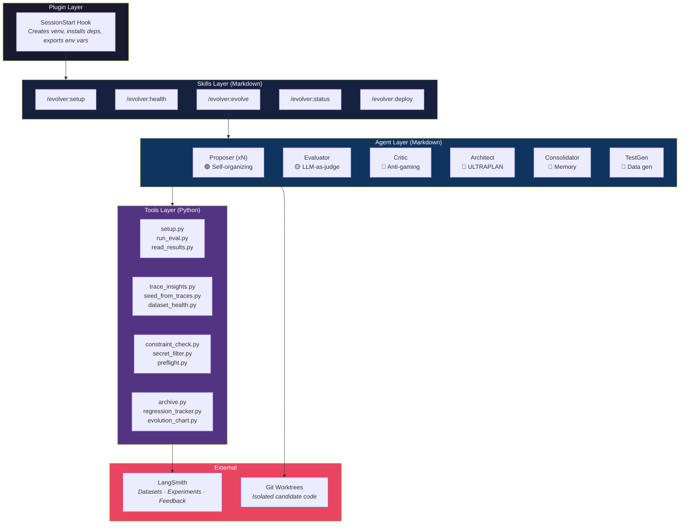
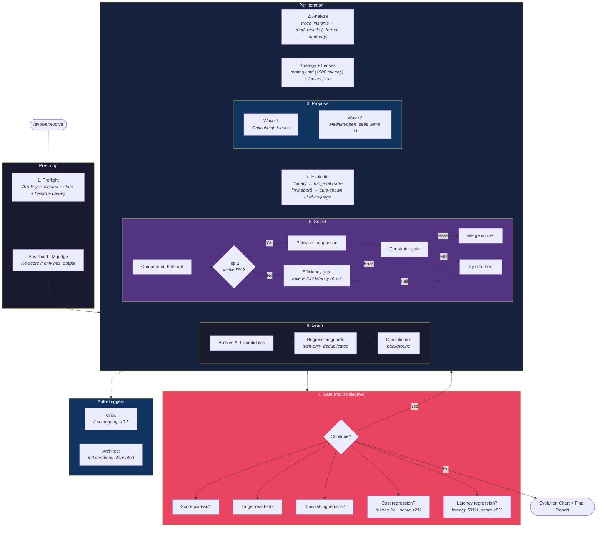
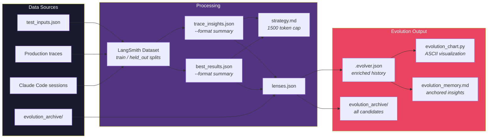
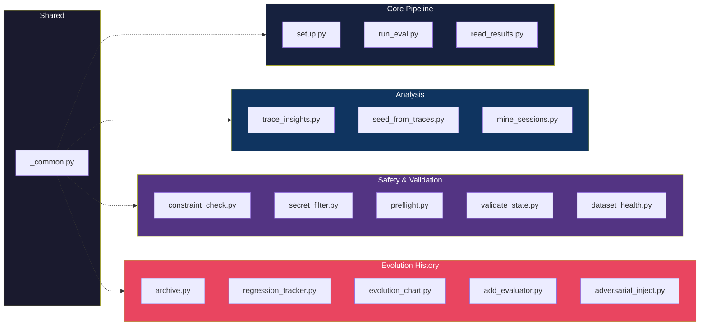

# Architecture

For the quick overview, see [README.md](../README.md).

## System Overview



## Evolution Loop



## Data Flow



## Tool Categories



## Entry Point Placeholders

| Placeholder | Behavior | Use when |
|---|---|---|
| `{input_text}` | Extracts plain text, shell-escapes it | Agent takes `--query "text"` or positional args |
| `{input}` | Passes path to a JSON file | Agent reads structured JSON from file |
| `{input_json}` | Passes raw JSON string inline | Agent parses JSON from command line |

```bash
python agent.py --query {input_text}   # text input
python agent.py {input}                # JSON file path
```
